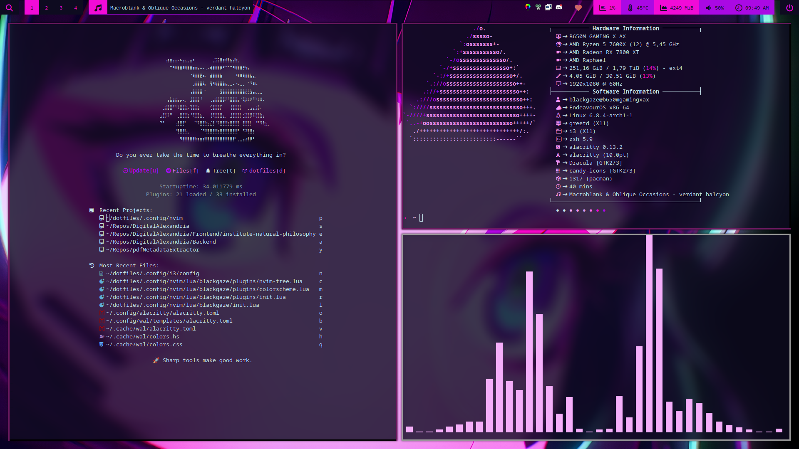
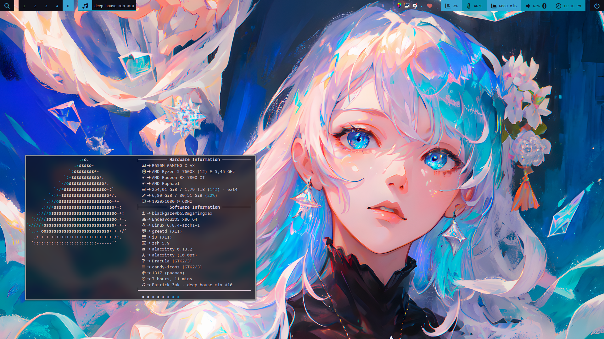
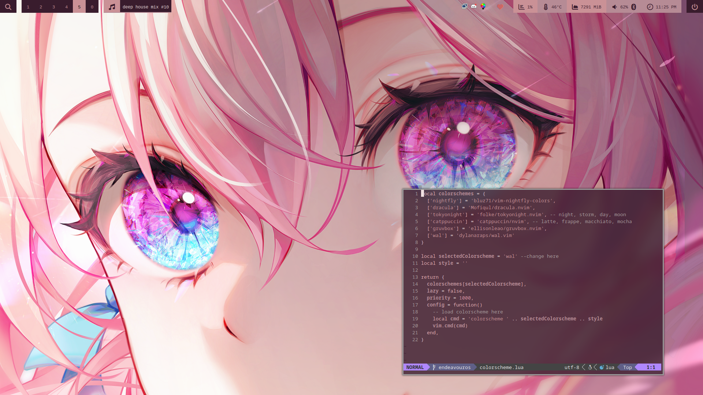

<h1 align="center">

<br>highonskooma's dotfiles<br>
</h1>
</br>

## 🖼️ Gallery





</br>

## Features
A Dynamic theme can be applied to the system based on the main colors of a wallpaper.
A script is run at every login that picks a random wallpapers from my wallpapers folder and uses [pywal](https://github.com/dylanaraps/pywal) to create a corresponding color scheme. This color scheme can be applied to [alacritty](https://alacritty.org/), [polybar](https://github.com/polybar/polybar), [neovim](https://neovim.io/) and [rofi](https://github.com/davatorium/rofi).

</br>

## Scripts
 -  wallpaperRandomizer.sh

```sh
#!/bin/bash

# Set the directory of your wallpapers
WALLPAPERS_DIR="$HOME/Pictures/wallpapers"

# Check if the wallpapers directory exists
if [ ! -d "$WALLPAPERS_DIR" ]; then
    echo "Wallpapers directory not found."
    exit 1
fi

# Get a random wallpaper from the wallpapers directory
random_wallpaper=$(ls $WALLPAPERS_DIR | shuf -n 1)

# Set the wallpaper using feh
feh --bg-fill "$WALLPAPERS_DIR/$random_wallpaper"

# Run pywal.sh script located in ~/Scripts if it exists
PYWAL_SCRIPT="$HOME/Scripts/pywal.sh"
if [ -f "$PYWAL_SCRIPT" ]; then
    bash "$PYWAL_SCRIPT" "$WALLPAPERS_DIR/$random_wallpaper"
else
    echo "pywal.sh script not found."
fi
```

 - [pywal.sh](.config/polybar/colorblocks/scripts/pywal.sh) - from [polybar-themes](https://github.com/adi1090x/polybar-themes).

</br>

## Theme specific configuration
My [alacritty](.config/alacritty/alacritty.toml) config imports a color scheme from `.config/wal/templates` like described [here](https://github.com/dylanaraps/pywal/pull/611#issuecomment-1922063972).
In neovim, I just use [wal.vim](https://github.com/dylanaraps/wal.vim).


Managed with gnu stow.

## Instructions 

1. Copy configuration file into ~/dotfiles directory following the same structure as the home folder.
2. Before running `stow .` make sure to commit any unsaved changes.

## Dealing with directories

1. Copy the whole directory to the corresponding ~/dotfiles location.
2. Run stow with the --adopt flag: `stow --adopt .`.

## New files/directories (plugins, extra configuration...)

New files cannot be added directly to the dotfiles directory, instead:

1. Make sure to create the file on the default config location.
2. Copy the file/directory into ~/dotfiles.
3. Run stow with the adopt flag (this will create the new symlinks).
